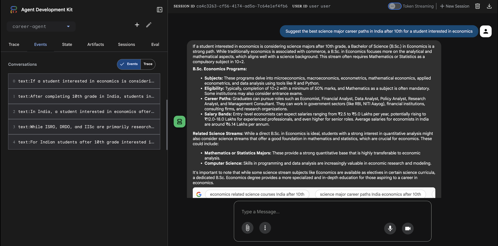

## Google ADK Web UI Demonstration

This section showcases the use of the **Google ADK Web UI** for developing, executing, and debugging the multi-agent career counsellor system.

---

### Multi-Agent Orchestration View

This view illustrates the **parallel and sequential orchestration** of agents within the system:

- Parallel execution of **AIResearcher, MathResearcher, ResearchFieldResearcher, and ScienceResearcher**
- Clear visualization of **agent dependencies and execution order**
- Tool invocations (e.g., **Google Search**) during agent execution
- AggregatorAgent execution only after all parallel agents complete

  
   
  <em>Parallel and sequential agent orchestration in Google ADK Web UI</em>

---

### Agent Execution, Events, and Output Inspection

This view demonstrates how the Web UI supports **interactive testing and debugging**:

- Displays **event logs and intermediate outputs** from each agent
- Shows how user queries propagate across multiple agents
- Enables inspection of **structured responses** for real-world prompts
- Helps validate correctness, completeness, and consistency of outputs

  
   
  <em>Agent execution trace and structured output inspection</em>

---

### Benefits of Using Google ADK Web UI

- Improves **observability** of multi-agent workflows  
- Enables **rapid iteration** on prompts, tools, and orchestration logic  
- Simplifies debugging of **tool-augmented LLM behavior**  
- Ensures reliability before downstream integration or deployment  

---
